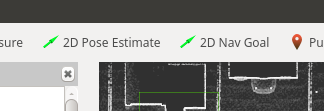

# Autoware in Carla

Integration of AutoWare AV software with the [CARLA simulator](http://carla.org/).

## Requirements

- ROS kinetic
- PointCloud Map

## Setup

    # Download pointcloud maps for Carla Towns
    cd ~
    git clone https://bitbucket.org/carla-simulator/autoware-contents
    mkdir carla-python

    #extract the Carla Python API from the image
    docker run --rm --entrypoint tar carlasim/carla:0.9.5 cC /home/carla/PythonAPI . | tar xvC carla-python

## Run

The Carla Simulator is splitted into two parts, a server- and a client-part.

### Server

The Server needs to be running in the background. Multiple clients might connect to it.

    nvidia-docker run -p 2000-2001:2000-2001 -it --rm carlasim/carla:0.9.5 ./CarlaUE4.sh /Game/Carla/Maps/Town01 -benchmark -carla-server -fps=20 -world-port=2000 -windowed -ResX=100 -ResY=100 -carla-no-hud

This will start a docker container and map the ports 2000-2001 to the local machine.

### Client/Ego Vehicle

The Carla client to spawn the ego vehicle can either be started via the runtime manager (`CARLA Simulator` on page Simulation) or with `roslaunch`.

*Caution*: Before executing the runtime manager, set the following environment variables:

    export PYTHONPATH=$PYTHONPATH:~/carla/dist/carla-0.9.5-py2.7-linux-x86_64.egg:~/carla-python/carla/
    export CARLA_MAPS_PATH=~/autoware-contents/maps

To execute it via commandline:

    #Option 1: including visualization of the ego vehicle and the ability to drive
    roslaunch carla_autoware_bridge carla_autoware_bridge_with_manual_control.launch

    #Option 2: without visualization
    roslaunch carla_autoware_bridge carla_autoware_bridge.launch

## Multi machine setup

You can run Autoware and Carla on different machines. 
To let the carla autoware bridge connect to a remote Carla Server, execute roslaunch with the following parameters

    roslaunch host:=<hostname> port:=<port number> carla_autoware_bridge carla_autoware_bridge_with_manual_control.launch

## Development support

### Carla Autoware Ego Vehicle

When starting the carla_autoware_bridge a random spawn point and a fixed goal is used to calculate the route.

To override this, you can use RVIZ.

- selecting a Pose with '2D Pose Estimate' will delete the current ego_vehicle and respawn it at the specified position.
- selecting a Pose with '2D Nav Goal' will set a new goal within `carla_waypoint_publisher`.

#### Sensor setup

The sensors are defined [here](carla_autoware_ego_vehicle/src/carla_autoware_ego_vehicle/carla_autoware_ego_vehicle).

### Manual steering

Press `B` to be able to steer the ego vehicle within ROS manual control.

Internally, this is done by stopping the conversion from the Autoware control message to AckermannDrive within the node `vehiclecmd_to_ackermanndrive`. The relevant ros-topic is `/vehicle_control_manual_override`.

## Design

Internally, three CARLA PythonAPI Clients are used to communicate.

1. CARLA ROS Bridge - Monitors existing actors in CARLA, publishes changes on ROS Topics (e.g. new sensor data)
2. CARLA Autoware Ego Vehicle - Instantiation of the ego vehicle with its sensor setup.
3. Waypoint Calculation - Uses the Carla Python API to calculate a route.

## Troubleshooting

### The pygame window is black

This means, that no images were received via the carla-autoware-bridge.
Please check:
- is the Carla Server running
- is the environment set up correctly

